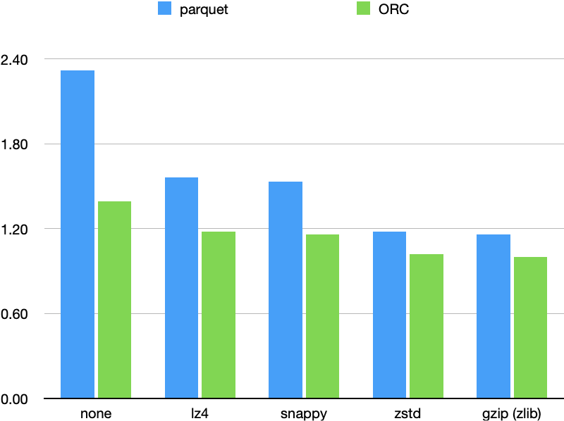

+++
title = "Comparison of Parquet and ORC"
[taxonomies]
tags = ["Spark"]
+++

I'm using Spark3.2.1 to convert MongoDB Bson files to Parquet and ORC. To save the cost, I want to choose a best combination of data type + compression. Both the data file size and the data size scanned in queries should be small, because they will be saved in AWS S3 and queried in AWS Athena, which computes cost by data scanned.

Since Bson is binary Json, the data is highly nested. A sample would be:

```json
{
  "_id":{
    "a":1,
    "b":2,
    ...
  },
  value:{
    "c": ..,// Map<String, Long>
    "d": ..,// Map<String, Map<String, Long>>
    ... // hundreds of other columns
  }
}
```


Different data will make a big difference on the comparison results. Below is just my own test result, you should do the test with your own data.

# Compression 

Parquet and ORC supports many compression algorithms. Check `ParquetOptions` and `OrcOptions` for detail lists.

```scala
object ParquetOptions {
  // The parquet compression short names
  private val shortParquetCompressionCodecNames = Map(
    "none" -> CompressionCodecName.UNCOMPRESSED,
    "uncompressed" -> CompressionCodecName.UNCOMPRESSED,
    "snappy" -> CompressionCodecName.SNAPPY,
    "gzip" -> CompressionCodecName.GZIP,
    "lzo" -> CompressionCodecName.LZO,
    "lz4" -> CompressionCodecName.LZ4,
    "brotli" -> CompressionCodecName.BROTLI,
    "zstd" -> CompressionCodecName.ZSTD)
}

object OrcOptions {
  // The ORC compression short names
  private val shortOrcCompressionCodecNames = Map(
    "none" -> "NONE",
    "uncompressed" -> "NONE",
    "snappy" -> "SNAPPY",
    "zlib" -> "ZLIB",
    "lzo" -> "LZO",
    "lz4" -> "LZ4",
    "zstd" -> "ZSTD")
}
```


The difference is that Parquet provides gzip while ORC provides zlib. [A good article to explain gzip and zlib.](https://dev.to/biellls/compression-clearing-the-confusion-on-zip-gzip-zlib-and-deflate-15g1)

LZO needs extra libraries so I didn't test it.

| **compression** | **Parquet** | **ORC** |
| --------------- | ----------- | ------- |
| none            | 2.32        | 1.39    |
| lz4             | 1.56        | 1.18    |
| snappy          | 1.53        | 1.16    |
| zstd            | 1.18        | 1.02    |
| gzip (zlib)     | 1.16        | 1.00    |




# Processing time

My app's logic is fairly simple, just parse and save. But ORC cost 3-4x times of Parquet. Maybe that's because of the way ORC handles nested columns. Or just simply because ORC wasn't optimized well enough compared to Parquet in Spark.

# Data scanned in queries

[Parquet uses Dremel algorithm](https://parquet.apache.org/documentation/latest/) to flatten the nested columns, while [ORC just nests columns in columns](https://orc.apache.org/specification/ORCv1/). So when read from a inner column, Parquet only reads the columns needed, while ORC needs to decompress the full outer columns.

A simple query in Athena can reveal this:

The files used in the test: Parquet=376MB, ORC=319MB

| SQL                                                 | Parquet data scanned | ORC data scanned |
| --------------------------------------------------- | -------------------- | ---------------- |
| select sum(value.a) from table;                     | 1.6 MB               | 303.94 MB        |
| select sum(value.b) from table;                     | 6.11                 | 303.94           |
| select sum(element_at(value.c, 'd').e) from table; | 97.14                | 303.94           |

# Conclusion

So, Parquet + gzip is good enough for me. The data size is sub-optimal, processing time is fast, data scanned is also small.

Further optimization like row group size and data page size can also be tested and applied, but just for now it's enough to leave them to the default.
