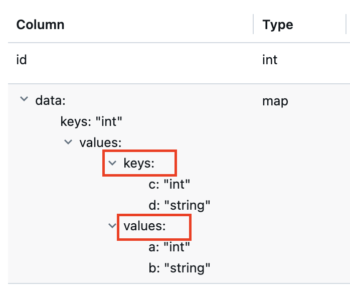

+++
title = "How to Drop Array/Map Nested Struct Fields in Databricks"

+++

# Environment

Databricks Runtime 16.4LTS

# The problem

Just as the title says, sometimes we need to drop some highly nested fields in a Delta Lake table. If the fields only belong to nested structs, then just separating the path by dots is enough (for example `a.b.c.d`). But when fields are nested in an array or map, then the SQLs are not very intuitive to write.

The official documentations of Delta Lake and Databricks didn’t provide good examples of how to drop a nested struct field within an Array. Though it provides an article about how to do it with the Map type [here](https://kb.databricks.com/dbsql/executing-drop-field-inside-a-nested-column-gives-an-invalid_field_name-error). 

In that article, the correct SQL query to drop the `b` in `data map<int, map<int, struct<a: int, b: string>>>` is `DROP COLUMN data.value.value.b`. The interesting part is where does the `value` field come from. Yes we all know a map contains key-value pairs and the `value` comes from the value part of the map, but no documentation mentioned the corresponding name.

Then what if we need to delete a field in a key struct? It’s easy to guess and the answer is using `key` as in `data.key.key.foo`.

From the Databricks UI table overview tab, we can see a Map structure contains `keys` and `values` fields, just corresponding the `key` and `value` in above SQLs, which is just a coincidence.

<div style="text-align: center;">
  
</div>

Why this is a coincidence? Because If we check the structure of a `array<array<struct<a: int, b: string>>>`, we’ll get items:


<div style="text-align: center;">
  
</div>

Then if we remove the plural form and use `DROP COLUMN data.item.item.a`, an error will occur.

So the keyword is not `item` for Array.

The true source of the internal field name lies in [Parquet’s logical type documentation](https://github.com/apache/parquet-format/blob/master/LogicalTypes.md#nested-types), where List(alias Array) has an `element` field, and Map has `key` and `value` fields. So the right keyword for Array is `element`.

```
<list-repetition> group <name> (LIST) {
  repeated group list {
    <element-repetition> <element-type> element;
  }
}

<map-repetition> group <name> (MAP) {
  repeated group key_value {
    required <key-type> key;
    <value-repetition> <value-type> value;
  }
}
```

# Full examples

## Drop map struct fields

```sql
CREATE OR REPLACE TABLE nested_table1 (id int, data map<int, map<struct<c: int, d: string>, struct<a: int, b: string>>>);

INSERT INTO nested_table1
SELECT
  111 AS id,
  map(2, map(struct(4, "aaa"), struct(5, "bbb"))) AS data;
  
ALTER TABLE nested_table1 SET TBLPROPERTIES ('delta.columnMapping.mode' = 'name');

ALTER TABLE nested_table1 DROP COLUMNS (data.value.key.d, data.value.value.a);

SELECT * FROM nested_table1;
```

## Drop array struct fields

```sql
CREATE OR REPLACE TABLE nested_table2 (id int, data array<array<struct<a: int, b: string>>>);

INSERT INTO nested_table2
SELECT
  111 AS id,
  array(array(struct(4, "aaa"), struct(5, "bbb"))) AS data;

ALTER TABLE nested_table2 SET TBLPROPERTIES ('delta.columnMapping.mode' = 'name');

ALTER TABLE nested_table2 DROP COLUMN data.element.element.a;

SELECT * FROM nested_table2;
```
